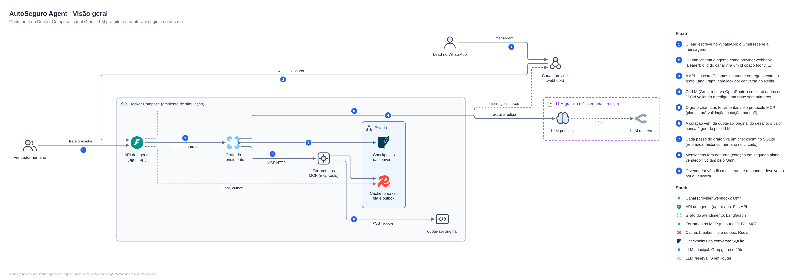
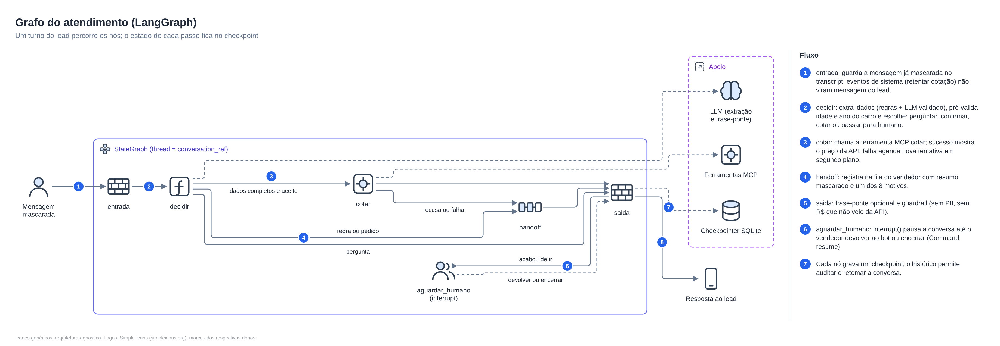
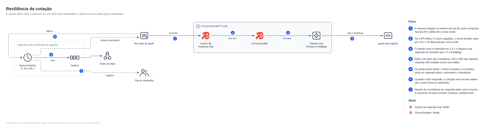
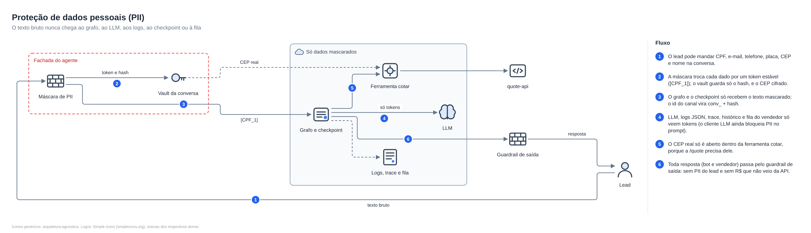
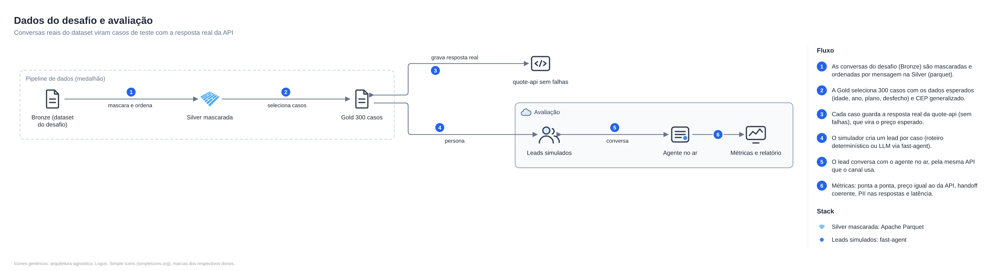

# AutoSeguro Agent (namastex-fde-challenge-response)

Agente de WhatsApp da seguradora fictícia AutoSeguro (desafio FDE da Namastex). Ele conversa com o lead, coleta os dados, cota na API do desafio e decide quando passar a conversa para um vendedor humano. Quando a API de cotação falha, ele não trava e não inventa preço.

Três regras guiam o projeto:
1. **Dado pessoal protegido:** nenhum CPF, telefone, e-mail, placa, CEP ou nome chega ao LLM, aos logs, ao checkpoint ou à fila.
2. **Valor real:** todo valor em R$ mostrado ao lead vem da resposta da `/quote`.
3. **Omni:** o canal é o [Omni](https://github.com/automagik-dev/omni), da própria Namastex.

Sumário: [1. Ficha técnica](#1-ficha-técnica) · [2. Guia rápido](#2-guia-rápido) · [3. Arquitetura](#3-arquitetura) · [4. Operação](#4-operação) · [5. Referência](#5-referência)

---

## 1. Ficha técnica

**Stack:** Python 3.14 (uv) · LangGraph (orquestração e checkpoints SQLite) · FastMCP (ferramentas) · FastAPI · Redis · Groq `gpt-oss-20b` com OpenRouter de reserva (opcional) · Omni (canal) · Docker Compose. Versões exatas em `pyproject.toml` e `uv.lock`.

**Containers:** `quote-api` :8000 (API original do desafio, submódulo) · `redis` · `mcp-tools` :8100 · `agent-api` :8080.

```
src/autoseguro/
  api/          FastAPI: canal, webhook do Omni, vendedor, rastreio
  agent/        grafo LangGraph, fachada, templates, extração, outbox
  tools/        servidor MCP, cliente da /quote, circuit breaker, fila, store
  guardrails/   máscara de PII e guardrail de saída
  channels/     adaptador do Omni
  llm/          Groq e OpenRouter com cache
  data/  sim/   pipeline Bronze/Silver/Gold, simulador e avaliação
tests/          unit, integration (contra a quote-api original), live (Groq)
docs/           ADRs, figuras, avaliação, execução, Omni, DEVLOG
vendor/challenge/  submódulo com o desafio original
```

---

## 2. Guia rápido

Pré-requisitos: `git` e Docker com Compose v2.

**1. Clonar** (o submódulo traz a quote-api original):
```bash
git clone --recurse-submodules https://github.com/FelipeRamosOliveira/namastex-fde-challenge-response.git autoseguro-agent && cd autoseguro-agent
```

**2. Criar o `.env`** com os segredos obrigatórios (`CHANNEL_API_KEY`, `TRACE_API_KEY`, `VAULT_KEY`):
```bash
cp .env.example .env && python3 -c "import base64,os,re,secrets as S;p='.env';s=open(p).read();[s:=re.sub(rf'^{k}=.*$',f'{k}={v}',s,flags=re.M) for k,v in {'CHANNEL_API_KEY':S.token_urlsafe(24),'TRACE_API_KEY':S.token_urlsafe(24),'VAULT_KEY':base64.urlsafe_b64encode(os.urandom(32)).decode()}.items()];open(p,'w').write(s)"
```

**3. Subir:**
```bash
docker compose up -d --build
```

**4. Carregar as chaves no terminal:**
```bash
set -a; . ./.env; set +a
```

**5. Testar** (deve responder e perguntar a idade):
```bash
curl -s localhost:8080/v1/messages -H 'content-type: application/json' -H "x-channel-key: $CHANNEL_API_KEY" -d '{"conversation_id":"demo","text":"oi, quero cotar meu Onix 2021"}'
```

Pronto. Opcional: `GROQ_API_KEY` no `.env` liga o LLM (sem ela, o agente usa só regras). Conversa completa até a cotação, variáveis, modo dev, testes e problemas comuns estão em [4. Operação](#4-operação).

---

## 3. Arquitetura

As figuras ficam em [`docs/figuras/`](docs/figuras/), com as specs editáveis em `docs/figuras/fonte/`. Os números azuis de cada figura seguem a ordem do fluxo, explicada logo abaixo dela.

### 3.1 Visão geral



Uma mensagem, do WhatsApp até a resposta:
1. O lead escreve no WhatsApp e o **Omni** recebe.
2. O Omni chama o agente em `POST /omni/webhook` (provider `webhook`, autenticado por Bearer). O id do canal, que no WhatsApp contém o telefone, vira um id opaco: `conv_` + hash.
3. A **API (FastAPI)** mascara os dados pessoais, trava a conversa (lock no Redis, para duas mensagens do mesmo lead não correrem juntas) e entrega o texto mascarado ao **grafo LangGraph**.
4. O grafo pode pedir ajuda ao **LLM** (Groq, com OpenRouter de reserva) para entender texto livre. O LLM só devolve dados em JSON validado e uma frase sem números; ele não decide o fluxo nem o preço.
5. Para agir, o grafo chama as **ferramentas MCP** (`mcp-tools`): consultar planos, pré-validar, cotar, registrar handoff.
6. A ferramenta `cotar` chama a **quote-api original**. O preço mostrado ao lead sai dessa resposta.
7. Cada passo do grafo vira um **checkpoint** no SQLite: é o que permite retomar, auditar e pausar para o humano.
8. Mensagens fora do turno (cotação que saiu em segundo plano, resposta do vendedor) voltam ao lead pelo Omni.
9. O **vendedor** vê a fila mascarada e pode responder, devolver a conversa ao bot ou encerrar.

### 3.2 Grafo do atendimento (LangGraph)



Cada turno do lead percorre os nós abaixo. O estado fica salvo por conversa (`thread_id = conversation_ref`).
1. **entrada:** registra a mensagem já mascarada. Um evento de sistema (nova tentativa de cotação) entra por aqui sem virar mensagem do lead.
2. **decidir:** extrai os dados (regras, com o LLM validado completando o que as regras não entendem) e pré-valida idade e ano do carro sem gastar chamada na API. Depois escolhe: perguntar o próximo dado, confirmar, cotar ou passar para humano. Se o lead corrigir um dado enquanto a cotação está em segundo plano, confirma de novo com o dado certo.
3. **cotar:** chama a ferramenta MCP. Se der certo, monta a resposta com o preço da API. Se a API estiver fora, avisa o lead e pede nova tentativa em segundo plano.
4. **handoff:** registra na fila do vendedor, com resumo mascarado e um dos 8 motivos (tabela em [5.2](#52-quando-o-agente-passa-para-um-humano)).
5. **saida:** acrescenta a frase-ponte do LLM quando cabe e aplica o guardrail de saída: nada de dado pessoal e nada de R$ que não veio da API. Se algo escapar, a resposta vira um texto seguro.
6. **aguardar_humano:** logo depois do handoff, `interrupt()` pausa a conversa. Mensagens do lead durante a pausa ficam no histórico sem acordar o bot. O vendedor retoma com `devolver` (o bot continua de onde parou) ou `encerrar`.
7. Cada nó grava um checkpoint. `GET /v1/conversations/{id}/historico` mostra a sequência inteira.

### 3.3 Resiliência da cotação



A `/quote` do desafio falha em 20% das chamadas e demora 8 s em outras 10%. As defesas, na ordem em que atuam:
1. **Cache:** a mesma cotação no mesmo dia sai da resposta real guardada, válida até a meia-noite.
2. **Circuit breaker:** depois de 3 cotações falhas seguidas, o circuito abre por 15 s e só deixa passar uma chamada de teste.
3. **Timeout e hedging:** cada chamada é cortada em 2,5 s. Se a primeira passar de 1,2 s, uma segunda sai em paralelo e vale a que responder primeiro.
4. **Retry com jitter:** até 4 chamadas no total. Erros 422 e 400 não são repetidos (o dado está errado, repetir não resolve). Uma resposta 200 com corpo inválido conta como falha.
5. **Segundo plano:** se ainda assim falhar, o lead é avisado ("já estou tentando de novo") e o agente agenda novas tentativas em 5, 20 e 60 s, retomando o grafo pelo checkpoint. As tentativas pendentes ficam no Redis e sobrevivem a um reinício.
6. Quando a API responde, a cotação real vai ao lead pelo **outbox** (Omni, webhook ou `GET .../outbox`).
7. Se as 3 tentativas em segundo plano falharem, a conversa vai para humano com o motivo `cotacao_indisponivel`.

### 3.4 Proteção de dados pessoais



1. O lead pode mandar CPF, e-mail, telefone, placa, CEP e nome no meio da conversa.
2. A **máscara** troca cada dado por um token estável (`[CPF_1]`: o mesmo CPF recebe sempre o mesmo token). O vault da conversa guarda só o hash de cada valor, exceto o CEP, que fica cifrado (Fernet) porque a cotação precisa dele.
3. O grafo e o checkpoint só recebem o texto mascarado. O id do canal vira `conv_` + hash.
4. LLM, logs JSON, trace, histórico e fila do vendedor só veem tokens. O cliente do LLM ainda tem uma segunda barreira que bloqueia o prompt se achar dado pessoal.
5. O CEP real só é aberto dentro da ferramenta `cotar`. Se a chave do vault mudar e o CEP ficar ilegível, o agente pede o CEP de novo em vez de cotar sem ele.
6. Toda resposta, do bot e do vendedor, passa pelo **guardrail de saída**: sem dado pessoal do lead e sem R$ que não veio da API. O vendedor pode dizer o próprio nome; o nome do lead é bloqueado.

### 3.5 Dados do desafio e avaliação



1. **Bronze:** o dataset de conversas do desafio, sem alteração. **Silver:** a mesma base mascarada e ordenada por mensagem, em parquet.
2. **Gold:** 300 casos com os dados esperados (idade, ano, plano, desfecho) e CEP generalizado.
3. Cada caso guarda a **resposta real da quote-api** (rodando sem falhas), que vira o preço esperado.
4. O **simulador** cria um lead por caso: roteiro determinístico (base da avaliação) ou conversa livre com LLM via fast-agent.
5. O lead simulado conversa com o agente no ar, pela mesma API que o canal usa.
6. Métricas: ponta a ponta, preço igual ao da API, handoff coerente com o caso, dado pessoal nas respostas e latência.

---

## 4. Operação

Com o serviço no ar: como exercitar, desenvolver, testar e resolver problemas.

### 4.1 Conversa completa até a cotação
Mesmo `conversation_id` do guia rápido, uma mensagem por vez:
```bash
for t in "tenho 35 anos" "cep 01310-100" "completo" "hoje" "sim"; do
  curl -s localhost:8080/v1/messages -H 'content-type: application/json' \
    -H "x-channel-key: $CHANNEL_API_KEY" \
    -d "{\"conversation_id\":\"demo\",\"text\":\"$t\"}"; echo; done
# última resposta: "stage":"cotado" e "Cotação pronta! Plano *Completo*: R$ ..."
# "stage":"aguardando_cotacao" = a /quote falhou (instabilidade do desafio);
# a cotação chega em segundos em GET /v1/conversations/demo/outbox (mesmo header)
```

Rastreio mascarado da conversa:
```bash
curl -s localhost:8080/v1/conversations/demo/trace -H "x-api-key: $TRACE_API_KEY"
```
`docker compose ps` deve mostrar os 4 containers `healthy`. Documentação interativa da API em `http://localhost:8080/docs`.

Variáveis do `.env`:

| Variável | Obrigatória no Docker | Para que serve |
|---|---|---|
| `CHANNEL_API_KEY` | sim | Header `x-channel-key` exigido em `/v1/messages` e no outbox |
| `VAULT_KEY` | sim | Chave Fernet que cifra o CEP. Rotação: `nova,antiga` |
| `TRACE_API_KEY` | recomendada | Header `x-api-key` do painel do vendedor e do rastreio |
| `GROQ_API_KEY` / `OPENROUTER_API_KEY` | não | LLM principal e reserva; sem elas, só regras |
| `OMNI_PROVIDER_KEY`, `OMNI_URL`, `OMNI_API_KEY` | não | Ligar a um Omni real (ver `docs/omni.md`); sem elas, `/omni/webhook` fica fechado |

Sem `CHANNEL_API_KEY` ou `VAULT_KEY`, o `agent-api` não sobe de propósito (`EXIGIR_SEGREDOS=true` no compose).

### 4.2 Modo desenvolvimento (sem rebuild a cada mudança)
```bash
docker compose -f docker-compose.yml -f docker-compose.dev.yml up -d
```
A pasta `src/` é montada no `agent-api` e no `mcp-tools`, que recarregam sozinhos em cerca de 1 s. Faça rebuild (`... up -d --build`) só quando mudar `pyproject.toml`, `uv.lock` ou o `Dockerfile`. Mudança no `.env` pede só `up -d` de novo, para recriar o container.

### 4.3 Sem Docker
```bash
uv sync
(cd vendor/challenge/quote-service && ../../../.venv/bin/python -m uvicorn app.main:app --port 8000) &
uv run uvicorn autoseguro.api.app:app --port 8080
```
Sem `REDIS_URL` e sem `MCP_URL`, cache e fila ficam em memória e as ferramentas MCP rodam no mesmo processo. Sem `CHANNEL_API_KEY`, o canal fica aberto (aviso no log; só para desenvolvimento).

### 4.4 Testes e checagens
```bash
uv run pytest                      # 176 testes: unitários + integração contra a quote-api original (LLM simulado)
uv run ruff check src tests scripts
uv run python scripts/sanitize_ai_logs.py --check
uv run pytest -m llm tests/live    # opcional, ao vivo com o Groq (precisa de GROQ_API_KEY e rede)
```

### 4.5 Problemas comuns

| Sintoma | Causa | Correção |
|---|---|---|
| Build falha em `vendor/challenge/quote-service` | Submódulo não baixado | `git submodule update --init` |
| `agent-api` reinicia com `EXIGIR_SEGREDOS=true e faltam...` | `.env` sem `CHANNEL_API_KEY` ou `VAULT_KEY` | Refazer o passo 2 e `docker compose up -d` |
| `401 chave do canal inválida` | Falta o header | Enviar `-H "x-channel-key: $CHANNEL_API_KEY"` |
| `403 conversas do Omni entram só por /omni/webhook` | `conversation_id` começando com `omni:` | Usar outro id; ids `omni:` são reservados ao webhook |
| `"stage":"aguardando_cotacao"` | A `/quote` falhou (instabilidade do desafio) | Esperado: consultar `GET /v1/conversations/<id>/outbox` depois de alguns segundos |
| Resposta sem frase natural | LLM desligado ou sem rede | Esperado sem `GROQ_API_KEY`; o fluxo não depende dele |

### 4.6 Regras para quem for mexer no código (pessoa ou IA)
- Nunca mostrar valor em R$ que não venha da `/quote`: use os templates de `agent/templates.py`.
- Todo texto do lead passa por `guardrails/pii.py` antes de qualquer LLM, log, trace, fila ou checkpoint.
- Não versionar o `.env`. Não editar os PNGs de `docs/figuras/` à mão (ver `docs/figuras/README.md`).
- Rodar `uv run pytest` e `uv run ruff check src tests scripts` antes de commitar.
- Contexto completo para agentes de IA em `CLAUDE.md`.

---

## 5. Referência

### 5.1 Resultados
Avaliação completa em `docs/avaliacao.md`.

| Cenário | Cotados | Preço igual ao da API | Handoff coerente | Em segundo plano | PII nas respostas |
|---|---|---|---|---|---|
| Instabilidade padrão (20% falha, 10% lenta), 300 conversas | 210/210 | 284/284 | 258/258 | 4 | 0 |
| Estresse (50% falha, 20% lenta), 100 conversas | 72/72 | 96/96 | 87/87 | 18 | 0 |

Nos dois cenários nenhuma conversa ficou sem desfecho e nenhuma foi para humano por indisponibilidade da API.

### 5.2 Quando o agente passa para um humano

| Motivo | Quando |
|---|---|
| `recusa_regra` | Pré-validação ou 422: idade acima de 75, veículo com mais de 20 anos |
| `cotacao_indisponivel` | A `/quote` segue fora depois das tentativas rápidas e das 3 em segundo plano |
| `pedido_humano` | O lead pede atendente |
| `objecao_preco` | Segunda objeção de preço, ou objeção citando concorrente (a primeira recebe a cotação real do Essencial) |
| `fora_de_escopo` | Sinistro, cancelamento, outro produto |
| `midia` | Segunda mídia depois do pedido para escrever |
| `sem_progresso` | 6 turnos sem dado novo |
| `pronto_para_fechar` | O lead aceita a proposta: emissão de apólice e boleto é humana, como no dataset |

### 5.3 Endpoints

| Rota | Quem usa | Chave |
|---|---|---|
| `GET /health` | Orquestrador | nenhuma |
| `POST /v1/messages` | Canal genérico (ids `omni:` recusados) | `x-channel-key` |
| `GET /v1/conversations/{id}/outbox` | Canal: mensagens ativas | `x-channel-key` |
| `POST /omni/webhook` | Omni (provider webhook) | `Authorization: Bearer <OMNI_PROVIDER_KEY>` |
| `GET /v1/handoffs` | Vendedor: fila mascarada | `x-api-key` (`TRACE_API_KEY`) |
| `POST /v1/conversations/{id}/operador` | Vendedor: `responder` (com guardrail), `devolver`, `encerrar` | `x-api-key` |
| `GET /v1/conversations/{id}/trace` | Rastreio mascarado | `x-api-key` |
| `GET /v1/conversations/{id}/historico` | Checkpoints do LangGraph | `x-api-key` |

Nas rotas do vendedor e de rastreio, `{id}` pode ser o `conversation_ref` (`conv_...`) que a fila mostra, para o telefone não ir na URL. Documentação interativa em `http://localhost:8080/docs`.

### 5.4 Rastreio
Cada turno gera eventos com `event_id`, `conversation_id` (opaco) e `message_id`: `message_in` (com os tipos de dado pessoal detectados), `extracao`, `pre_validacao`, `cotacao` (com `quote_request_id`, `quote_id`, tentativas, status HTTP, latência, hedge e cache), `handoff` e `message_out`. Os eventos também saem no log do container, um JSON por linha (`docker compose logs agent-api`). Execuções completas de exemplo em `docs/execucao/` (regerar: `uv run python scripts/exportar_execucao.py`).

### 5.5 Decisões de arquitetura
Detalhes em `docs/adr/`.

| # | Decisão | Por quê |
|---|---|---|
| 0001 | LangGraph orquestra; FastMCP expõe ferramentas; fast-agent só simula leads | Um único dono do estado da conversa |
| 0002 | Grafo chama MCP pelo `fastmcp.Client` | `langchain-mcp-adapters` quebra com mcp 2.x |
| 0003 | Timeout curto, hedging, retry, circuit breaker e cache | Não esperar os 8 s da chamada lenta |
| 0004 | Máscara com tokens estáveis e vault por conversa | LLM e logs nunca veem o dado; o CEP real só é usado na cotação |
| 0005 | Valores só via template a partir da API | Preço inventado é impossível por construção e bloqueado na saída |
| 0006 | Dataset em Bronze, Silver e Gold | Gold com respostas reais da API vira base de avaliação |
| 0007 | LLM só interpreta e redige frase sem números | Entende texto livre sem poder decidir fluxo nem preço |
| 0008 | Cotação em segundo plano retomando o checkpoint; humano com `interrupt()` | Queda passageira não vira handoff; vendedor responde, devolve ou encerra |

### 5.6 Desenvolvimento assistido por IA
- `CLAUDE.md` e `.claude/`: contexto, regras, hooks e subagentes de revisão.
- `docs/DEVLOG.md`: o que a IA propôs, o que foi aceito ou rejeitado, e os achados das duas revisões independentes.
- `ai-logs/`: export das sessões, sanitizado por `scripts/sanitize_ai_logs.py`.
